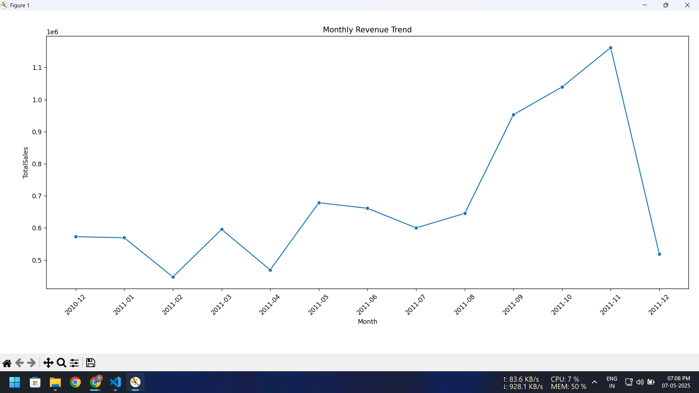
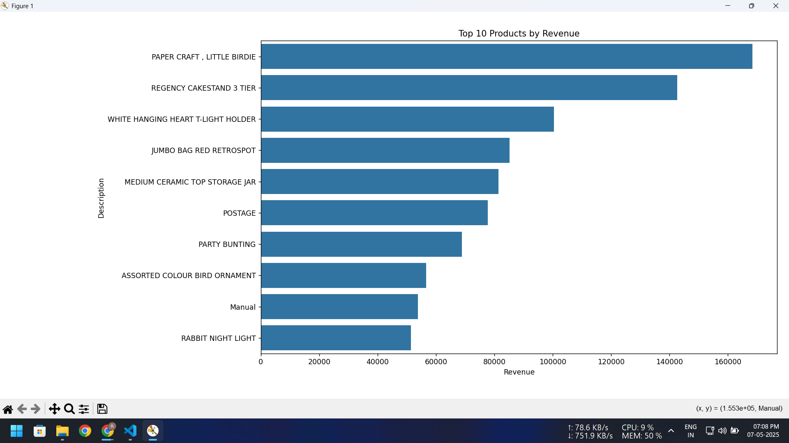
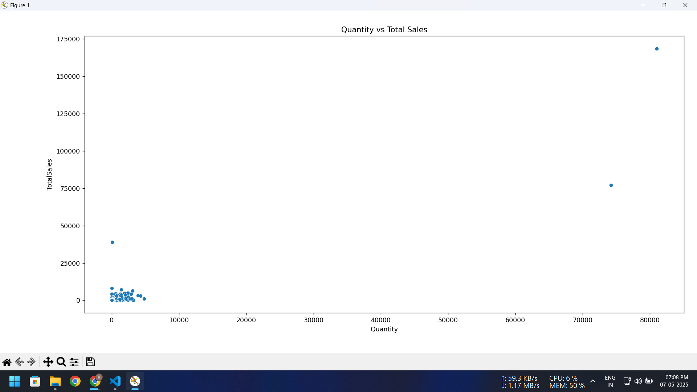

# 🛍️ Retail Business Performance & Profitability Analysis

## 👋 Overview
This project is all about digging into retail data to understand how a business is really performing. I focused on uncovering which products are profitable, which ones are slowing things down, and what trends appear over time (like seasonal demand). 

The idea was to turn raw sales data into actionable insights that a business could actually use to improve profits and manage inventory better.

---

## 🛠️ Tools I Used
- **SQL (SQLite):** For cleaning data and analyzing profit margins  
- **Python (Pandas, Seaborn, Matplotlib):** For deeper analysis and visualizations  
- **PNG Charts / Tableau:** To visualize key patterns and trends  
- **Jupyter Notebook + VS Code:** For scripting and development

---

## 📂 What's in this Repository
| File                         | What's Inside                                      |
|-----------------------------|----------------------------------------------------|
| `online_retail.csv`         | Raw retail dataset                                |
| `clean_online_retail.csv`   | Cleaned dataset used for analysis                 |
| `retail_analysis.sqlite`    | SQLite database file                              |
| `retail_analysis_queries.sql` | SQL queries used for the analysis               |
| `visualization.py`          | Python script for generating graphs               |
| `monthly_trend.png`         | Line chart showing revenue trends by month        |
| `top_products.png`          | Bar chart of top 10 best-selling products         |
| `quantity_vs_sales.png`     | Dot chart showing quantity vs total sales         |
| `Retail_Analysis_Report.pdf`| Final 2-page summary report                       |

---

## 📊 Key Insights
- Found which products generate the most and least revenue  
- Identified seasonal buying patterns across months  
- Highlighted slow-moving inventory that might need clearance  
- Recommended focusing on high-profit, fast-selling items

---

## 📸 Visual Highlights

### Monthly Revenue Trend

### Top Products by Revenue

### Quantity vs Sales

---

## 🧠 What I Learned
- Writing and optimizing SQL queries for business analysis
- Creating meaningful visualizations that tell a story
- Drawing conclusions from raw data that could help real businesses
